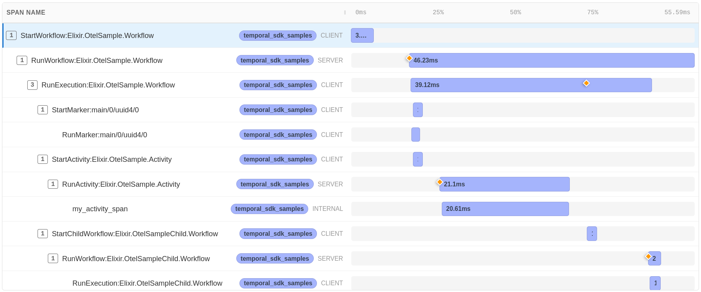
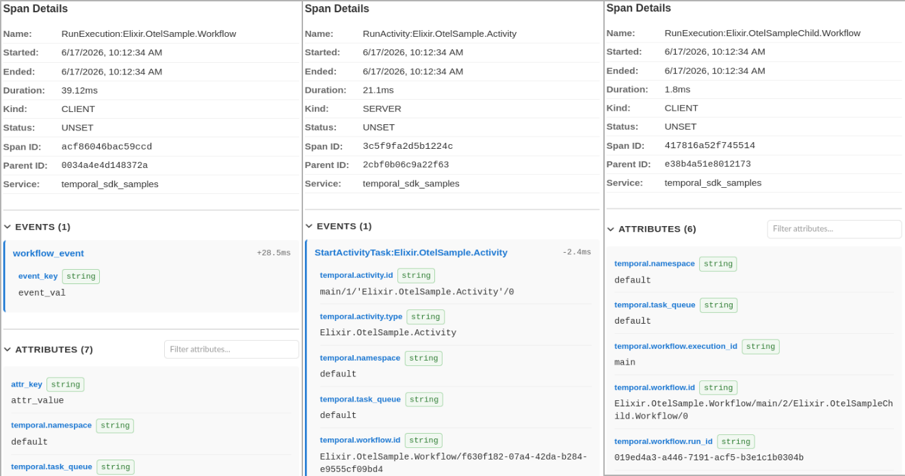

OpenTelemetry usage sample.

This sample demonstrates common OpenTelemetry operations, including setting and propagating
baggage, setting attributes, adding events, and starting spans.

Example run:

<!-- tabs-open -->

### Elixir

```elixir
iex(1)> OtelSample.run()
{:ok,
 %{
   started: true,
   request_id: ~c"cluster_1-Elixir.OtelSample.Workflow-acc38a75-7a65-4d38-9281-ebf41f25560f",
   workflow_execution: %{
     workflow_id: "Elixir.OtelSample.Workflow/f630f182-07a4-42da-b284-e9555cf09bd4",
     run_id: "019ed4a3-a420-708e-a70f-570419b31651"
   }
 }}
```

Sample source:
[lib/otel_sample](https://github.com/andrzej-mag/temporal_sdk_samples/tree/main/lib/otel_sample)

### Erlang

```erlang
1> otel_sample:run().
{ok,#{started => true,
      request_id =>
          "cluster_1-otel_sample_workflow-7bd11973-0833-4373-9e0e-3ec564ab3b56",
      workflow_execution =>
          #{workflow_id =>
                <<"otel_sample_workflow/2acb9469-4635-4de6-95d1-9388f8b35afd">>,
            run_id => <<"019ed086-2d62-74fc-ae3f-7fdf4540295a">>}}}
```

Sample source:
[src/otel_sample](https://github.com/andrzej-mag/temporal_sdk_samples/tree/main/src/otel_sample)

<!-- tabs-close -->

Workflow execution OpenTelemetry trace (Elixir):



Selected spans details for the workflow execution trace above:


