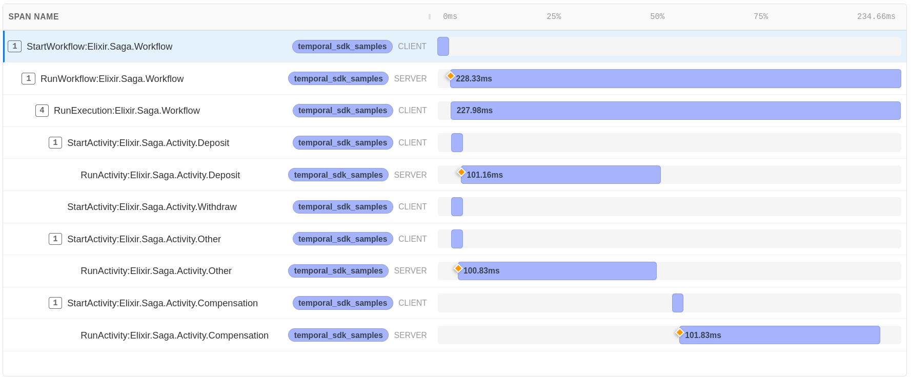

Saga pattern example.

Example workflow execution:

<!-- tabs-open -->

### Elixir

```elixir
iex(1)> Saga.start()
Compensation activity started with:
    %{"deposit" => "completed", "other" => "failed", "withdraw" => "canceled"}

{%{
   started: true,
   request_id: ~c"cluster_1-Elixir.Saga.Workflow-c131876a-996d-4029-915c-580b44e8261c",
   workflow_execution: %{
     workflow_id: ~c"Elixir.Saga.Workflow/afc4ca7f-ade2-4941-8bd3-934749a7cc47",
     run_id: "019a91f0-f010-7c7d-b6e8-cd7dd21efd0c"
   }
 },
 {:completed,
  %{result: [], workflow_task_completed_event_id: 25, new_execution_run_id: ""}}}
```

Sample source:
[lib/saga](https://github.com/andrzej-mag/temporal_sdk_samples/tree/main/lib/saga)

### Erlang

```erlang
1> saga:start().
Compensation activity started with:
    #{<<"deposit">> => <<"completed">>,<<"other">> => <<"failed">>,
      <<"withdraw">> => <<"canceled">>}

{#{started => true,
   request_id =>
       "cluster_1-saga_workflow-6fb23eee-bbe2-4ebd-9d4a-13ac2af91de4",
   workflow_execution =>
       #{workflow_id =>
             "saga_workflow/25ff0aa8-e337-4453-b417-33409f7b684c",
         run_id => <<"019a2163-e32c-7394-83d3-cfa10fbf0620">>}},
 {completed,#{result => [],workflow_task_completed_event_id => 28,
              new_execution_run_id => <<>>}}}
```

Sample source:
[src/saga](https://github.com/andrzej-mag/temporal_sdk_samples/tree/main/src/saga)

<!-- tabs-close -->

Corresponding other SDKs implementations:

* [Go SDK](https://github.com/temporalio/samples-go/tree/main/saga),
* [Ruby SDK](https://github.com/temporalio/samples-ruby/tree/main/saga).

Workflow execution OpenTelemetry trace (Elixir):


